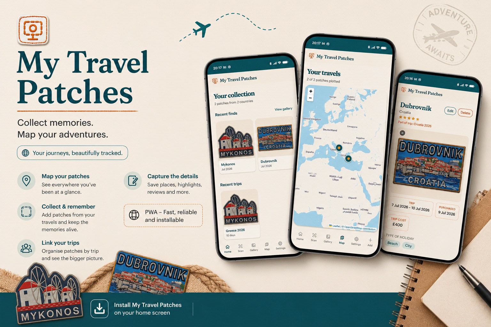

# My Travel Patches

An installable web app for cataloguing a physical travel patch collection. Scan a patch with your phone to match it against patches you've already logged using on-device computer vision, record memories and details from each trip, and explore your collection through an interactive world map and sticker-style gallery.

## Features

- **Scan-to-match** — scan a patch with your phone's camera and match it against your existing collection using on-device MobileNet embeddings and perceptual hashing.
- **Rich patch logging** — record locations, trip and purchase dates, travel companions, holiday types, ratings, reviews, costs, accommodation, restaurants, memorable dishes, and photos.
- **Trips** — group patches from the same trip together with a shared itinerary, highlights, and review.
- **Gallery** — browse patches as background-removed stickers, with filtering and sorting.
- **Interactive map** — view your entire patch collection geographically, with locations automatically geocoded and plotted on a world map.
- **Background removal** — automatically remove patch backgrounds to create sticker-style images for the gallery.
- **Installable PWA** — install the app on iOS or Android with camera access.
- **Account management** — create an account, reset or change your password, change your email, and permanently delete your account and its data.

## Tech Stack

- **React & TypeScript** — frontend UI and application logic
- **Tailwind CSS** — application styling
- **Vite** — development and production build tooling
- **Supabase** — PostgreSQL database, authentication, storage, row-level security, and account deletion Edge Function
- **TensorFlow.js & MobileNet** — on-device image embeddings for patch matching
- **Cloudflare Workers & Cloudflare Images** — server-side patch background removal
- **IMG.LY Background Removal** — on-device fallback for background removal
- **Leaflet & OpenStreetMap** — interactive mapping
- **Cloudflare Turnstile** — CAPTCHA protection for authentication
- **Vite PWA** — PWA installation
